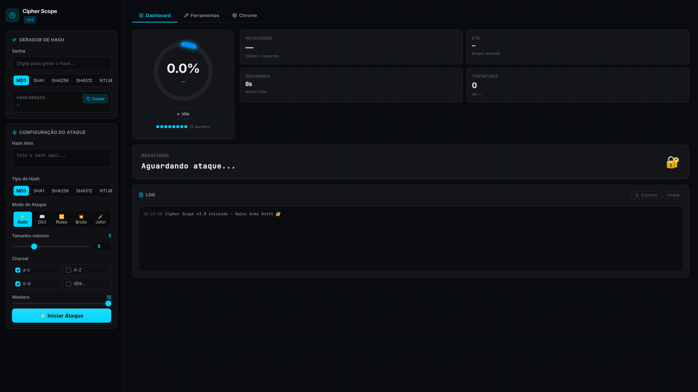
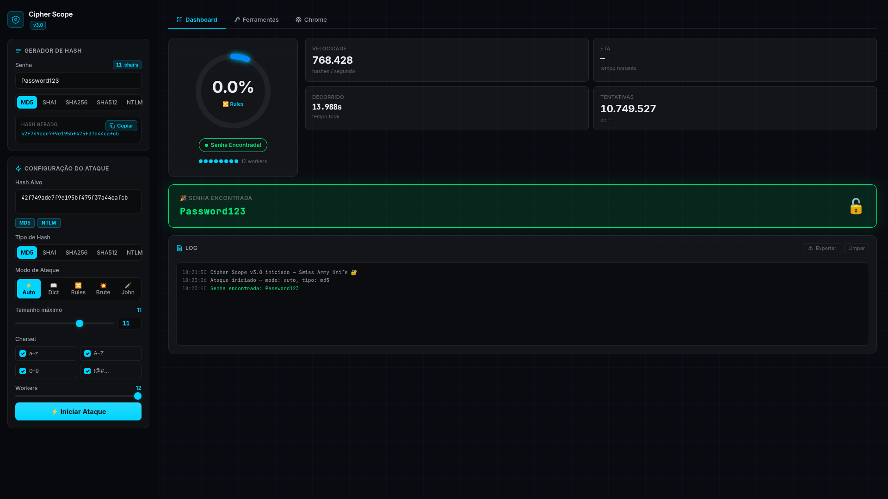
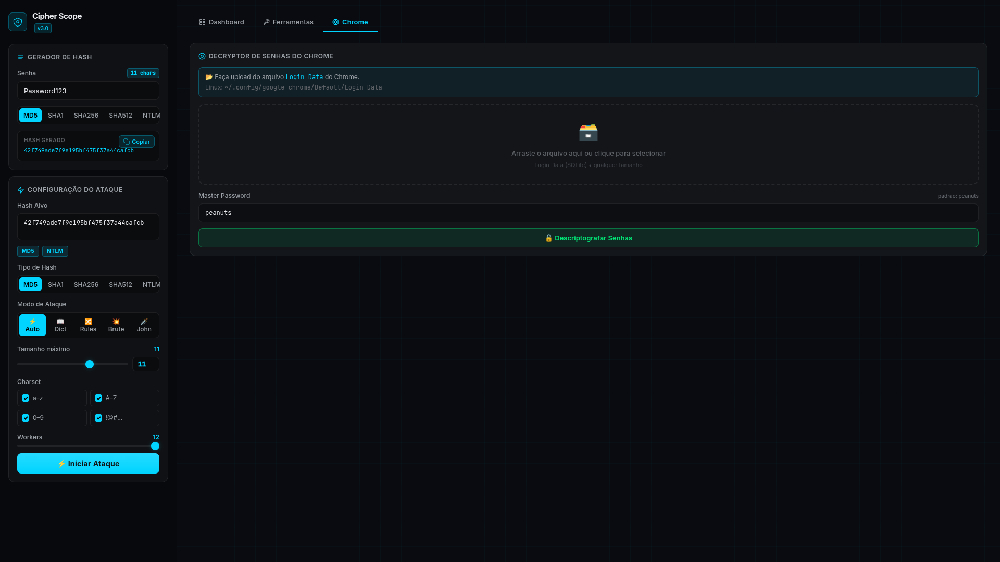
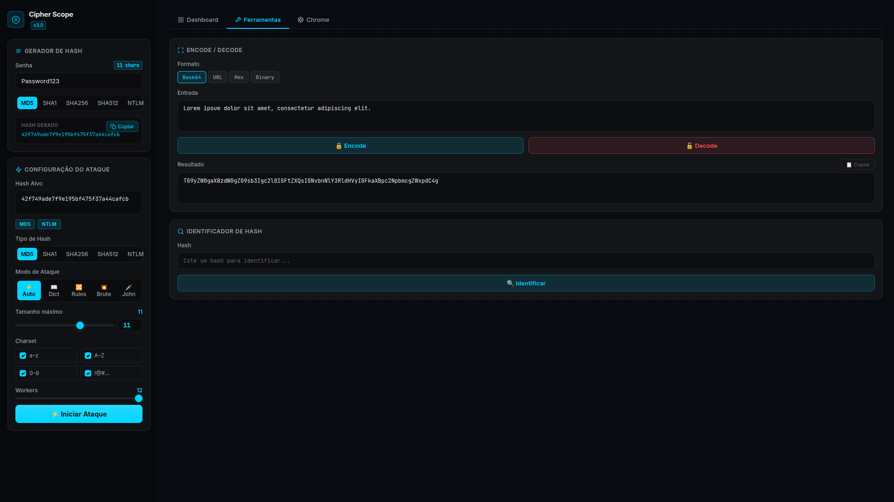

<div align="center">

# 🔐 Cipher Scope

### Canivete suíço de segurança com dashboard web em tempo real

Quebra hashes, decodifica dados, extrai senhas do Chrome e muito mais.

**Escrito em Go puro — roda em Linux, Windows, macOS, ARM e TV Box.**

<p>
  
  
  
  
</p>

</div>

---

# 📸 Interface

## 📊 Dashboard Principal

<p>

  </p>

Dashboard em tempo real com:

- progresso via SSE;
- ETA e tentativas;
- taxa de hashes por segundo;
- logs em tempo real;
- exportação de resultados;
- dark mode.

---

## 🔓 Hash Cracker

<p>

  </p>

Suporte a:

- Dictionary Attack;
- Rules Attack (l33t, sufixos, capitalização);
- Brute Force paralelo;
- John the Ripper;
- execução distribuída Master/Worker.

---

## 🌐 Extrator de Senhas do Chrome

<p>

  </p>

Permite:

- importar o arquivo `Login Data` do Chrome/Chromium;
- descriptografar credenciais armazenadas localmente;
- visualizar URL, usuário e senha em uma tabela interativa;
- exportar os resultados para `.csv`;
- realizar auditorias, recuperação de credenciais próprias e análises forenses autorizadas diretamente pelo dashboard.
---

## 🛠️ Ferramentas Integradas

<p>

  </p>

Inclui:

- geração de hashes;
- identificação automática de hashes;
- Encode/Decode:
  - Base64
  - URL
  - Hexadecimal
  - Binário
- extração de credenciais do Chrome.

---
## ✨ Funcionalidades

| Categoria | Funcionalidade |
|-----------|---------------|
| **Hash Cracker** | Dictionary, Rules (mutações l33t), Brute Force, John the Ripper |
| **Gerador de Hash** | MD5, SHA1, SHA256, SHA512, NTLM — com contador de caracteres em tempo real |
| **Identificador de Hash** | Detecta o tipo automaticamente ao colar um hash |
| **Encode / Decode** | Base64, URL, Hexadecimal, Binário |
| **Chrome Decrypter** | Upload do `Login Data` e extração de senhas v10/v11 (AES-CBC) |
| **Dashboard** | Dark mode, progresso em tempo real via SSE, exportar log em .txt |
| **Distribuído** | Master/Worker via TCP para múltiplas máquinas em paralelo |
| **Cross-platform** | Compila para ARM32, ARM64, x86, Windows, macOS — sem CGo |

---

## 🛠️ Instalação do Go (pré-requisito)

### Linux x86_64 (PC comum)

```bash
# Baixar e instalar Go 1.22+
wget https://go.dev/dl/go1.22.5.linux-amd64.tar.gz
sudo rm -rf /usr/local/go
sudo tar -C /usr/local -xzf go1.22.5.linux-amd64.tar.gz

# Adicionar ao PATH (adicione ao seu ~/.bashrc ou ~/.profile)
export PATH=$PATH:/usr/local/go/bin

# Verificar
go version
```

### TV Box ARM64 (Amlogic S905X3+, Rockchip RK3318...)

```bash
# Baixar Go para ARM64
wget https://go.dev/dl/go1.22.5.linux-arm64.tar.gz
sudo rm -rf /usr/local/go
sudo tar -C /usr/local -xzf go1.22.5.linux-arm64.tar.gz

export PATH=$PATH:/usr/local/go/bin
go version
```

### TV Box ARM32 (dispositivos 32-bit antigos)

```bash
wget https://go.dev/dl/go1.22.5.linux-armv6l.tar.gz
sudo rm -rf /usr/local/go
sudo tar -C /usr/local -xzf go1.22.5.linux-armv6l.tar.gz

export PATH=$PATH:/usr/local/go/bin
go version
```

### Android (Termux)

```bash
pkg update && pkg install golang git
go version
```

> 💡 Sempre verifique a versão mais recente em [go.dev/dl](https://go.dev/dl/)

---

## 🚀 Como Usar

### Opção 1 — Usar binário pré-compilado (mais fácil para TV Box)

Baixe o binário já compilado da [página de releases](https://github.com/JonathanMar/cipher-scope/releases):

```bash
# ARM64 (TV Box moderna)
wget https://github.com/JonathanMar/cipher-scope/releases/latest/download/cipher-scope-arm64
chmod +x cipher-scope-arm64
./cipher-scope-arm64 -addr 0.0.0.0:8080 -no-browser
```

### Opção 2 — Compilar do fonte

```bash
git clone https://github.com/JonathanMar/cipher-scope.git
cd cipher-scope

# Baixar dependências
go mod download

# Rodar diretamente (desenvolvimento)
go run .

# Compilar binário nativo
go build -o cipher-scope .
./cipher-scope
```

O dashboard abre automaticamente em `http://localhost:8080`.

### Flags disponíveis

```
-addr string        Endereço de escuta (default ":8080")
                    Use "0.0.0.0:8080" para acesso pela rede
-no-browser         Não abrir o browser automaticamente
```

---

## 📺 Guia completo — Rodando na TV Box

> Testado em **Tanix TX6** (Allwinner H6, ARM64) com Linux/Android + Termux.  
> Funciona em qualquer TV Box com ARM64 ou ARM32.

Existem dois modos de uso:

| Modo | Quando usar |
|------|------------|
| **Standalone** | Uma TV Box rodando o dashboard sozinha — acesse pelo celular/PC na rede |
| **Distribuído** | Várias TV Boxes como workers + PC como master — distribuem o brute force em paralelo |

---

### 🖥️ Modo Standalone — TV Box como servidor do dashboard

Neste modo a TV Box roda o Cipher Scope completo e você acessa o dashboard de qualquer dispositivo na rede.

#### Passo 1 — Descobrir a arquitetura da TV Box

```bash
uname -m
```

| Resultado | Binário a usar |
|-----------|---------------|
| `aarch64` | `cipher-scope-arm64` ✅ (maioria das TV Boxes modernas) |
| `armv7l`  | `cipher-scope-arm32` |
| `armv8l`  | `cipher-scope-arm64` |

#### Passo 2 — Baixar o binário correto (na TV Box)

```bash
# ARM64 (ex: Tanix TX6, X96 Max, H96 Max...)
wget https://github.com/JonathanMar/cipher-scope/releases/latest/download/cipher-scope-arm64

# ARM32 (TV Boxes antigas 32-bit)
wget https://github.com/JonathanMar/cipher-scope/releases/latest/download/cipher-scope-arm32
```

#### Passo 3 — Permissão e execução

```bash
chmod +x cipher-scope-arm64

# ⚠️ Use sempre 0.0.0.0 (nunca o IP fixo da interface)
./cipher-scope-arm64 -addr 0.0.0.0:8080 -no-browser
```

#### Passo 4 — Descobrir o IP da TV Box e acessar

```bash
hostname -I
# Ex: 192.168.0.113
```

No **celular, PC ou tablet** na mesma rede Wi-Fi:
```
http://192.168.0.113:8080
```

---

### 🖧 Modo Distribuído — Master (PC) + Workers (TV Boxes)

Neste modo o PC divide o espaço de combinações e as TV Boxes fazem o trabalho pesado em paralelo.

```
┌──────────────────────────────────────────────┐
│              REDE LOCAL Wi-Fi                 │
│                                              │
│   💻 PC / Notebook (master)                  │
│      go run ./master -addr :9000             │
│      IP: 192.168.0.100                       │
│            │                                 │
│     ┌──────┼──────┐                          │
│     ▼      ▼      ▼                          │
│   📺TV1  📺TV2  📺TV3   (workers)            │
│   :9000  :9000  :9000                        │
└──────────────────────────────────────────────┘
```

#### 🖥️ No Master (PC principal)

O master coordena o ataque e distribui as tarefas para os workers.

**Passo 1 — Compilar e iniciar o master**

```bash
# Clonar o projeto (precisa do Go instalado)
git clone https://github.com/JonathanMar/cipher-scope.git
cd cipher-scope

# Iniciar o master — aguarda workers na porta 9000
go run ./master -addr :9000
```

O master vai pedir interativamente:
```
Master ouvindo em :9000
Hash alvo: <cole o hash aqui>
Tipo de hash (md5, sha1, sha256): md5
Tamanho da senha: 6
Quantos workers aguardar? 2
Aguardando workers...
```

**Passo 2 — Aguardar os workers conectarem**

Depois que todos os workers conectarem, o ataque inicia automaticamente e o resultado aparece no terminal do master.

---

#### 📺 Nos Workers (cada TV Box)

Cada TV Box baixa o binário e conecta ao master.

**Passo 1 — Baixar o binário (em cada TV Box)**

```bash
wget https://github.com/JonathanMar/cipher-scope/releases/latest/download/cipher-scope-arm64
chmod +x cipher-scope-arm64
```

**Passo 2 — Conectar ao master**

> Substitua `192.168.0.100` pelo IP real do seu PC/master.

```bash
# Conectar ao master e usar 4 threads locais
./cipher-scope-arm64 -worker -master 192.168.0.100:9000 -workers 4
```

> 💡 `-workers 4` = número de threads na **TV Box local**. Use `nproc` para ver quantos cores ela tem.

**Passo 3 (opcional) — Rodar em background via SSH**

```bash
# Do PC, copiar o binário para a TV Box
scp cipher-scope-arm64 usuario@192.168.0.113:~/

# Conectar e iniciar o worker em background
ssh usuario@192.168.0.113 \
  "nohup ./cipher-scope-arm64 -worker -master 192.168.0.100:9000 -workers 4 > worker.log 2>&1 &"

# Acompanhar o log do worker remotamente
ssh usuario@192.168.0.113 "tail -f worker.log"
```

---

#### 📋 Resumo rápido — Ordem de inicialização

```
1. [PC]   go run ./master -addr :9000         ← inicia primeiro
2. [TV1]  ./cipher-scope-arm64 -worker -master 192.168.0.100:9000 -workers 4
3. [TV2]  ./cipher-scope-arm64 -worker -master 192.168.0.100:9000 -workers 4
          (repita para cada TV Box)
```

> ⚠️ Sempre inicie o **master antes dos workers**. Os workers aguardam conexão por 30 segundos.

---

### 🔌 Gerenciar TV Box via SSH (do PC)

```bash
# Copiar binário para a TV Box
scp cipher-scope-arm64 usuario@192.168.0.113:~/

# Iniciar o dashboard em background (acesso pela rede)
ssh usuario@192.168.0.113 \
  "nohup ./cipher-scope-arm64 -addr 0.0.0.0:8080 -no-browser > cipher.log 2>&1 &"

# Ver log em tempo real
ssh usuario@192.168.0.113 "tail -f cipher.log"

# Parar o servidor
ssh usuario@192.168.0.113 "pkill cipher-scope-arm64"
```

---

### ⚠️ Erros comuns e soluções

| Erro | Causa | Solução |
|------|-------|---------|
| `bind: cannot assign requested address` | IP fixo passado em `-addr` não pertence a esta máquina | Use `-addr 0.0.0.0:8080` |
| `permission denied` | Sem permissão de execução | `chmod +x cipher-scope-arm64` |
| `exec format error` | Binário errado para a arquitetura | Verifique `uname -m` e use o binário correto |
| Dashboard não abre no celular | Firewall bloqueando porta | `sudo ufw allow 8080` |
| Worker não conecta ao master | IP do master errado ou master não iniciado | Inicie o master **antes** dos workers |
| `no such file or directory` | Binário não está no diretório atual | Use `./cipher-scope-arm64` com `./` |

---

## 📦 Cross-compile (compilar na sua máquina, rodar na TV Box)

```bash
# ARM64 — TV Boxes modernas (Amlogic S905X3+, Rockchip RK3318, RK3399...)
GOOS=linux GOARCH=arm64 go build -ldflags="-s -w" -o cipher-scope-arm64 .

# ARM32 — TV Boxes antigas 32-bit (GOARM=7 para Cortex-A7/A9)
GOOS=linux GOARCH=arm GOARM=7 go build -ldflags="-s -w" -o cipher-scope-arm32 .

# Copiar para a TV Box via SCP
scp cipher-scope-arm64 usuario@192.168.x.x:~/
```

> ✅ **Sem CGo:** o projeto usa `modernc.org/sqlite` (SQLite em Go puro), portanto cross-compile funciona sem precisar de toolchain C para ARM.

---


## 🗂️ Dashboard — Abas

### 📊 Dashboard (ataque)

| Painel | Funcionalidade |
|--------|---------------|
| **Gerador de Hash** | Digite → hash gerado ao vivo com **contador de caracteres** |
| **Configuração** | Hash alvo, tipo, modo, workers, **tamanho máximo até 64** |
| **Identificador** | Cola o hash → detecta MD5/NTLM/SHA1/SHA256/SHA512 automaticamente |
| **Anel de Progresso** | SVG animado com % em tempo real |
| **Stats** | H/s, ETA, tempo decorrido, tentativas |
| **Resultado** | Banner de sucesso/falha com a senha encontrada |
| **Log** | Histórico com timestamp + botão **Exportar .txt** |

### 🔧 Ferramentas

| Ferramenta | Formatos |
|-----------|---------|
| **Encode / Decode** | Base64, URL, Hexadecimal, Binário |
| **Identificador de Hash** | MD5, NTLM, SHA1, SHA256, SHA512 |

### 🌐 Chrome

Upload do arquivo `Login Data` do Chrome para extrair senhas salvas:
- **Linux:** `~/.config/google-chrome/Default/Login Data`
- **Chromium:** `~/.config/chromium/Default/Login Data`
- Campo de **master password** configurável (padrão Linux: `peanuts`)
- Tabela com URL, usuário e senha descriptografada
- Exportar tudo como **CSV**

---

## 🔐 Hashes suportados

| Tipo | Tamanho | Uso comum |
|------|---------|-----------|
| MD5 | 32 hex | Legado, BD antigos |
| SHA1 | 40 hex | Git, certificados antigos |
| SHA256 | 64 hex | TLS, JWT, Linux shadow |
| SHA512 | 128 hex | Linux shadow ($6$), APIs |
| NTLM | 32 hex | Windows / Active Directory |

---

## ⚔️ Modos de Ataque

| Modo | Descrição |
|------|-----------|
| **⚡ Auto** | Tenta: Dictionary → Rules → Brute Force |
| **📖 Dict** | Wordlist pura (`wordlist.txt`) |
| **🔀 Rules** | Wordlist + mutações (l33t, sufixos, capitalização) |
| **💥 Brute** | Todas combinações de 1 até N chars (configurável até 64) |
| **🗡️ John** | John the Ripper externo (se instalado) |

---

## 🔌 API REST

| Método | Endpoint | Descrição |
|--------|----------|-----------|
| `POST` | `/api/hash` | Gera hash (md5/sha1/sha256/sha512/ntlm) |
| `POST` | `/api/crack` | Inicia um ataque |
| `POST` | `/api/stop` | Para o ataque em andamento |
| `GET`  | `/api/progress` | SSE — progresso em tempo real |
| `POST` | `/api/encode` | Encode/Decode (base64/url/hex/binary) |
| `POST` | `/api/identify` | Identifica o tipo de um hash |
| `POST` | `/api/chrome` | Extrai senhas do Chrome (multipart/form-data) |
| `GET`  | `/api/info` | Info do sistema (workers, John disponível) |

### Exemplos

```bash
# Gerar hash SHA512
curl -X POST http://localhost:8080/api/hash \
  -H 'Content-Type: application/json' \
  -d '{"password":"hello","type":"sha512"}'

# Gerar hash NTLM (Windows/AD)
curl -X POST http://localhost:8080/api/hash \
  -H 'Content-Type: application/json' \
  -d '{"password":"Password1","type":"ntlm"}'

# Identificar tipo de hash
curl -X POST http://localhost:8080/api/identify \
  -H 'Content-Type: application/json' \
  -d '{"hash":"5d41402abc4b2a76b9719d911017c592"}'
# {"candidates":["md5","ntlm"],"isHex":true,"length":32}

# Encode Base64
curl -X POST http://localhost:8080/api/encode \
  -H 'Content-Type: application/json' \
  -d '{"value":"hello world","format":"base64","action":"encode"}'
# {"result":"aGVsbG8gd29ybGQ="}

# Iniciar ataque
curl -X POST http://localhost:8080/api/crack \
  -H 'Content-Type: application/json' \
  -d '{
    "hash":      "5d41402abc4b2a76b9719d911017c592",
    "hashType":  "md5",
    "mode":      "auto",
    "workers":   4,
    "maxLength": 6,
    "charset":   "abcdefghijklmnopqrstuvwxyz0123456789",
    "wordlist":  "wordlist.txt"
  }'

# Parar ataque
curl -X POST http://localhost:8080/api/stop
```

---

## 🖧 Modo Distribuído (Master / Worker)

O master divide o espaço de combinações entre os workers automaticamente.

### Master — flags disponíveis

| Flag | Padrão | Descrição |
|------|--------|-----------|
| `-addr` | `:9000` | Endereço de escuta TCP |
| `-hash` | — | Hash alvo a quebrar |
| `-type` | — | Tipo: `md5`, `sha1`, `sha256`, `sha512`, `ntlm` |
| `-length` | — | Tamanho da senha |
| `-workers` | `1` | Qtd. de workers a aguardar antes de iniciar |
| `-charset` | `a-zA-Z0-9` | Charset para brute force |

### Worker — flags disponíveis

| Flag | Padrão | Descrição |
|------|--------|-----------|
| `-master` | `192.168.0.66:9000` | Endereço do master |
| `-workers` | núm. de CPUs | Goroutines locais de processamento |

---

### Uso não-interativo (recomendado para scripts e SSH)

```bash
# Master — passar tudo via flags (sem input interativo)
go run ./master \
  -addr    :9000 \
  -hash    c899a91880ee511c03f5810cf9eaa022 \
  -type    md5 \
  -length  10 \
  -workers 2

# Cada worker — conectar ao master
go run ./worker -master 192.168.0.100:9000 -workers 4
```

### Uso interativo (fallback — pede os dados no terminal)

```bash
# Master sem flags — solicita hash, tipo e tamanho interativamente
go run ./master -addr :9000

# Worker
go run ./worker -master 192.168.0.100:9000 -workers 4
```

> 💡 **Ordem de inicialização:** sempre inicie o **master antes dos workers**.  
> Os workers aguardam conexão e reconectam automaticamente com backoff exponencial.

---


## 🧪 Testes

```bash
# Rodar todos os testes
go test ./...

# Com detalhes
go test ./crypto/... ./core/... ./server/... -v

# Resultado esperado: 38 testes, todos PASS
```

---

## 🗂️ Estrutura do Projeto

```
cipher-scope/
├── main.go               # Servidor HTTP + embed da UI
├── ui/                   # Dashboard (HTML/CSS/JS) — embutido no binário
│   ├── index.html        # 3 abas: Dashboard, Ferramentas, Chrome
│   ├── style.css
│   └── app.js
├── server/               # Handlers HTTP, SSE, estado do ataque
│   ├── server.go         # /api/crack, /api/stop, /api/progress, /api/info
│   └── tools_handler.go  # /api/hash, /api/encode, /api/identify, /api/chrome
├── attacks/              # Motores de ataque
│   ├── dictionary.go     # Wordlist streaming
│   ├── rules.go          # Mutações l33t, sufixos, capitalização
│   ├── bruteforce.go     # Brute force paralelo com workers
│   ├── john.go           # Integração com John the Ripper
│   └── browser.go        # Extração de credenciais do Chrome (CLI)
├── core/                 # Engine de workers, validação, tipos
├── crypto/               # MD5, SHA1, SHA256, SHA512, NTLM, Chrome AES
├── master/               # Nó master do modo distribuído
├── worker/               # Nó worker do modo distribuído
└── utils/                # Logger
```

---

## ⚠️ Aviso Legal

Esta ferramenta é destinada exclusivamente a **testes de segurança autorizados**, **CTFs**, **recuperação de senhas próprias** e fins educacionais.

O uso não autorizado contra sistemas de terceiros é ilegal e antiético. O autor não se responsabiliza pelo uso indevido.

---

## 📄 Licença

MIT © [JonathanMar](https://github.com/JonathanMar)
